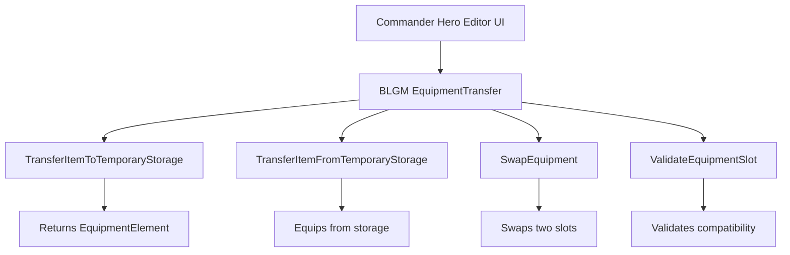

Based on my analysis of the BLGM codebase, I've created a detailed implementation plan for the equipment management methods needed by Commander's Hero Editor. Let me provide more context:

## Implementation Overview

## Method Specifications

**TransferItemToTemporaryStorage**
- Removes item from specified equipment slot
- Returns the EquipmentElement for temporary storage
- Clears the slot by setting it to EquipmentElement.Invalid
- Handles both Battle and Civilian equipment

**TransferItemFromTemporaryStorage**
- Takes ItemObject and target slot
- Creates EquipmentElement and assigns to slot
- Validates item can be equipped in slot
- Preserves item modifiers if present

**SwapEquipment**
- Swaps items between two equipment slots
- Handles empty slots gracefully
- Works within same equipment set (battle or civilian)
- Uses temporary variable for atomic swap

**ValidateEquipmentSlot**
- Checks if ItemObject type matches EquipmentIndex slot
- Returns boolean for validity
- Follows Bannerlord's slot-type mapping (Head armor in Head slot, etc.)
- Handles weapon slots (Weapon0-3) specially

## Key Design Decisions

1. **Static Class Pattern**: Following BLGM patterns seen in HeroExtensions, ItemExtensions
2. **Error Handling**: Return booleans or nullable types rather than throwing exceptions
3. **Validation First**: All methods validate inputs before modifying state
4. **Existing Code Reuse**: Will leverage GetAppropriateSlotForItem logic already in ItemManagementCommands

## Questions for Clarification

1. Should TransferItemToTemporaryStorage handle both Battle and Civilian equipment, or do you want separate methods?
2. For ValidateEquipmentSlot, should it also validate weapon types (e.g., two-handed weapons can't go in shield hand)?
3. Do you want the methods to support item modifiers (masterwork, legendary, etc.) during transfers?

Are you satisfied with this plan, or would you like any adjustments before I proceed to Code mode for implementation?