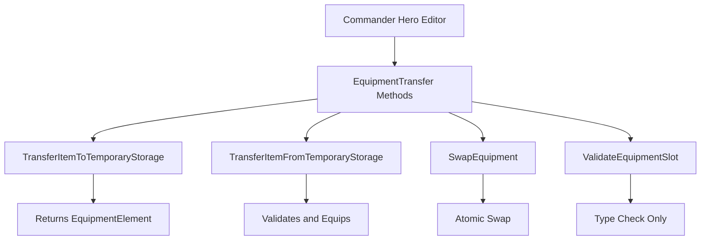

# Equipment Transfer System Implementation Plan

## Overview
Implement equipment management methods in BLGM to support Commander's Hero Editor inventory popup system.

## Requirements Summary
Based on user clarification:
- **Single methods** that work with both Battle and Civilian equipment via Equipment parameter
- **Basic slot validation** only (HeadArmor → Head slot, etc.)
- **Preserve all item modifiers** during transfers
- **No deep weapon validation** (game handles weapon switching logic)

## Architecture



## Method Specifications

### 1. TransferItemToTemporaryStorage
```csharp
public static EquipmentElement TransferItemToTemporaryStorage(Hero hero, Equipment equipment, EquipmentIndex slot)
```
**Purpose**: Remove item from equipment slot and return it for temporary storage

**Parameters**:
- `Hero hero` - The hero whose equipment is being modified
- `Equipment equipment` - The equipment set (hero.BattleEquipment or hero.CivilianEquipment)
- `EquipmentIndex slot` - The slot to remove item from

**Returns**: `EquipmentElement` containing the item and its modifier (or EquipmentElement.Invalid if slot is empty)

**Logic**:
1. Validate hero and equipment are not null
2. Check if slot has an item
3. Get EquipmentElement from slot (preserves modifiers)
4. Clear slot by setting to EquipmentElement.Invalid
5. Return the EquipmentElement

---

### 2. TransferItemFromTemporaryStorage
```csharp
public static bool TransferItemFromTemporaryStorage(Hero hero, Equipment equipment, ItemObject item, EquipmentIndex slot, ItemModifier modifier = null)
```
**Purpose**: Equip item from temporary storage to specified slot

**Parameters**:
- `Hero hero` - The hero whose equipment is being modified
- `Equipment equipment` - The equipment set to modify
- `ItemObject item` - The item to equip
- `EquipmentIndex slot` - The target slot
- `ItemModifier modifier` - Optional modifier to apply (defaults to null)

**Returns**: `bool` - true if successful, false if validation fails

**Logic**:
1. Validate all parameters
2. Call ValidateEquipmentSlot(item, slot) to verify compatibility
3. If valid, create EquipmentElement with item and modifier
4. Assign to equipment[slot]
5. Return true/false based on success

---

### 3. SwapEquipment
```csharp
public static bool SwapEquipment(Hero hero, Equipment equipment, EquipmentIndex slot1, EquipmentIndex slot2)
```
**Purpose**: Atomically swap items between two equipment slots

**Parameters**:
- `Hero hero` - The hero whose equipment is being modified
- `Equipment equipment` - The equipment set to modify
- `EquipmentIndex slot1` - First slot
- `EquipmentIndex slot2` - Second slot

**Returns**: `bool` - true if successful

**Logic**:
1. Validate parameters
2. Get EquipmentElement from slot1
3. Get EquipmentElement from slot2
4. Assign slot2's element to slot1
5. Assign slot1's element to slot2
6. Return true (handles empty slots gracefully)

---

### 4. ValidateEquipmentSlot
```csharp
public static bool ValidateEquipmentSlot(ItemObject item, EquipmentIndex slot)
```
**Purpose**: Check if item type is compatible with slot type

**Parameters**:
- `ItemObject item` - The item to validate
- `EquipmentIndex slot` - The target slot

**Returns**: `bool` - true if compatible, false otherwise

**Logic**:
1. Validate item is not null
2. Get item.ItemType
3. Call GetItemTypeForSlot(slot) to get expected type
4. Compare and return match result
5. Special handling for weapon slots (Weapon0-3 accept multiple types)

---

### 5. GetItemTypeForSlot (Helper)
```csharp
private static ItemObject.ItemTypeEnum? GetItemTypeForSlot(EquipmentIndex slot)
```
**Purpose**: Map equipment slot to expected item type

**Returns**: `ItemTypeEnum?` - Expected type or null for weapon slots (accept multiple)

**Mapping**:
- Head → HeadArmor
- Body → BodyArmor
- Leg → LegArmor
- Gloves → HandArmor
- Cape → Cape
- Horse → Horse
- HorseHarness → HorseHarness
- Weapon0-3 → null (accepts any weapon/shield type)

## File Structure

```
Bannerlord.GameMaster/
├── Equipment/                          (NEW FOLDER)
│   └── EquipmentTransfer.cs           (NEW FILE)
├── Items/
│   └── ItemExtensions.cs              (existing - reference for patterns)
└── Heroes/
    └── HeroExtensions.cs              (existing - reference for patterns)
```

## Implementation Details

### Namespace
`Bannerlord.GameMaster.Equipment`

### Class Structure
```csharp
namespace Bannerlord.GameMaster.Equipment
{
    /// <summary>
    /// Provides equipment transfer and validation methods for Hero inventory management
    /// </summary>
    public static class EquipmentTransfer
    {
        // Public methods...
        // Private helper methods...
    }
}
```

### Error Handling Strategy
- **Null checks**: Return false or EquipmentElement.Invalid for null parameters
- **Validation failures**: Return false rather than throwing exceptions
- **Empty slots**: Handled gracefully (EquipmentElement.Invalid is valid state)
- **No exceptions**: All methods return success/failure indicators

### Key Design Patterns
1. **Static utility class** - Follows BLGM pattern seen in HeroExtensions, ItemExtensions
2. **Equipment parameter** - Single methods work with any Equipment instance
3. **Modifier preservation** - EquipmentElement contains both Item and Modifier
4. **Basic validation** - Type matching only, no complex weapon rules
5. **Safe operations** - No exceptions, clear return values

## Testing Scenarios

1. **Transfer from empty slot** - Should return EquipmentElement.Invalid
2. **Transfer with modifier** - Should preserve legendary/masterwork modifiers
3. **Transfer to invalid slot** - Should return false (helm to leg slot)
4. **Swap two filled slots** - Should exchange items atomically
5. **Swap with empty slot** - Should move item to empty slot
6. **Weapon slot flexibility** - Should accept shields, bows, swords in any weapon slot
7. **Null parameter handling** - All methods should handle gracefully

## Integration with Commander

Commander will use these methods via:
```csharp
using Bannerlord.GameMaster.Equipment;

// In Hero Editor ViewModel
var removedItem = EquipmentTransfer.TransferItemToTemporaryStorage(
    hero, 
    hero.BattleEquipment, 
    EquipmentIndex.Head
);

// Store in temporary inventory (ItemRoster or List<EquipmentElement>)
temporaryStorage.Add(removedItem);

// Later, equip from storage
bool success = EquipmentTransfer.TransferItemFromTemporaryStorage(
    hero,
    hero.BattleEquipment,
    selectedItem.Item,
    EquipmentIndex.Head,
    selectedItem.ItemModifier
);

// Swap slots via drag-drop
bool swapped = EquipmentTransfer.SwapEquipment(
    hero,
    hero.BattleEquipment,
    EquipmentIndex.Weapon0,
    EquipmentIndex.Weapon1
);
```

## Success Criteria

- All methods implemented with proper signatures
- Comprehensive XML documentation on all public methods
- Null checks and validation on all parameters
- Item modifiers preserved through all operations
- Basic slot type validation working
- No exceptions thrown, safe return values
- Code follows BLGM patterns and standards
- Methods tested with various scenarios

## Notes

- Commander manages UI state and temporary storage (ItemRoster or List)
- BLGM only handles the equipment manipulation logic
- Game's native weapon switching logic is separate from slot assignment
- Validation is intentionally basic per user requirements
