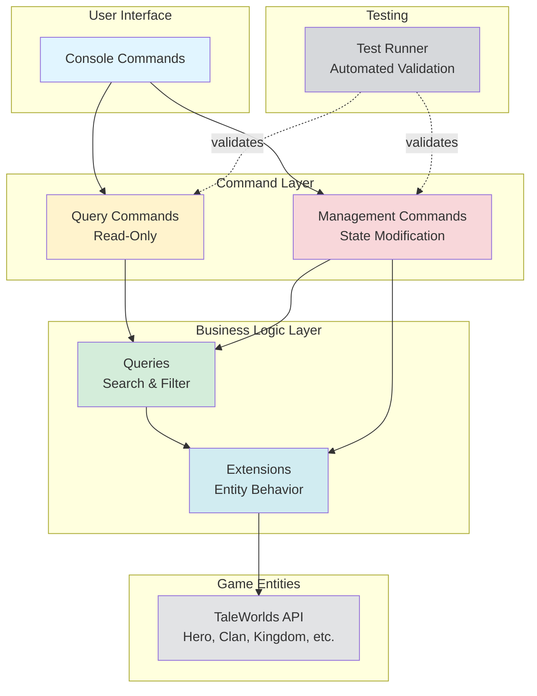

# Architecture Overview

**Navigation:** [Back to Index](../README.md) | [Next: Implementation Workflow →](../implementation/workflow.md)

---

## Introduction

The Bannerlord.GameMaster mod follows a **layered architecture** with clear separation of concerns. This document explains how the system is structured and how components interact.

## System Layers

```
┌─────────────────────────────────────────────────────┐
│          Console Commands Layer                      │
│    (Query Commands + Management Commands)            │
├─────────────────────────────────────────────────────┤
│          Common/Infrastructure Layer                 │
│    (CommandBase, Logger, Validator, Result)         │
├─────────────────────────────────────────────────────┤
│          Domain Logic Layer                          │
│    (Extensions + Queries for each entity)           │
├─────────────────────────────────────────────────────┤
│          Game Engine Layer                           │
│    (TaleWorlds.CampaignSystem)                      │
└─────────────────────────────────────────────────────┘
```

## Architecture Diagram

The following diagram shows how the different layers interact:



## Layer Descriptions

### 1. Domain Logic Layer

**Location:** `Bannerlord.GameMaster/{Domain}/`  
**Files:** `{Domain}Extensions.cs`, `{Domain}Queries.cs`

**Purpose:** Provides domain-specific logic without coupling to console commands

**Components:**
- **Extensions**: Add behavior to game entities ([`Hero`](../../Bannerlord.GameMaster/Heroes/HeroExtensions.cs), [`Clan`](../../Bannerlord.GameMaster/Clans/ClanExtensions.cs), [`Kingdom`](../../Bannerlord.GameMaster/Kingdoms/KingdomExtensions.cs))
- **Queries**: Provide search and filtering capabilities

**Example Structure (Heroes):**
```
Heroes/
├── HeroExtensions.cs    → GetHeroTypes(), HasAllTypes(), FormattedDetails()
└── HeroQueries.cs       → QueryHeroes(), GetHeroById(), ParseHeroTypes()
```

### 2. Console Commands Layer

**Location:** `Bannerlord.GameMaster/Console/`  
**Files:** `{Domain}ManagementCommands.cs`, `Query/{Domain}QueryCommands.cs`

**Purpose:** Exposes domain functionality as console commands

**Split by Operation Type:**
- **Query Commands** (read-only): List, search, and display entity information
- **Management Commands** (write): Modify game state (set properties, transfer entities, etc.)

**Example Structure:**
```
Console/
├── Query/
│   ├── HeroQueryCommands.cs     → gm.query.hero, gm.query.hero_info
│   ├── ClanQueryCommands.cs     → gm.query.clan, gm.query.clan_info
│   └── KingdomQueryCommands.cs  → gm.query.kingdom
└── HeroManagementCommands.cs    → gm.hero.set_clan, gm.hero.kill, etc.
```

### 3. Common/Infrastructure Layer

**Location:** `Bannerlord.GameMaster/Console/Common/`  
**Files:** [`CommandBase.cs`](../../Bannerlord.GameMaster/Console/Common/CommandBase.cs), [`CommandLogger.cs`](../../Bannerlord.GameMaster/Console/Common/CommandLogger.cs), [`CommandResult.cs`](../../Bannerlord.GameMaster/Console/Common/CommandResult.cs), [`CommandValidator.cs`](../../Bannerlord.GameMaster/Console/Common/CommandValidator.cs)

**Purpose:** Shared utilities for command implementation

**Key Classes:**

| Class | Purpose | Key Methods |
|-------|---------|-------------|
| [`CommandBase`](../../Bannerlord.GameMaster/Console/Common/CommandBase.cs) | Entity resolution & validation | [`FindSingleHero()`](../../Bannerlord.GameMaster/Console/Common/CommandBase.cs:21), [`FindSingleClan()`](../../Bannerlord.GameMaster/Console/Common/CommandBase.cs:44) |
| [`Cmd`](../../Bannerlord.GameMaster/Console/Common/CommandBase.cs:286) | Command execution wrapper | [`Run(args, action)`](../../Bannerlord.GameMaster/Console/Common/CommandBase.cs:291) |
| [`CommandLogger`](../../Bannerlord.GameMaster/Console/Common/CommandLogger.cs) | Persistent logging | [`LogCommand()`](../../Bannerlord.GameMaster/Console/Common/CommandLogger.cs:74) |
| [`CommandValidator`](../../Bannerlord.GameMaster/Console/Common/CommandValidator.cs) | Input validation | [`ValidateIntegerRange()`](../../Bannerlord.GameMaster/Console/Common/CommandValidator.cs:14) |

### 4. Testing Infrastructure

**Location:** `Bannerlord.GameMaster/Console/Testing/`  
**Files:** [`TestRunner.cs`](../../Bannerlord.GameMaster/Console/Testing/TestRunner.cs), [`TestCase.cs`](../../Bannerlord.GameMaster/Console/Testing/TestCase.cs), [`TestResult.cs`](../../Bannerlord.GameMaster/Console/Testing/TestResult.cs)

**Purpose:** Automated testing of console commands using reflection

**Key Features:**
- **Reflection-based execution**: Finds and invokes commands without tight coupling
- **Test categories**: Groups tests by domain (HeroQuery, ClanManagement, etc.)
- **Custom validators**: Supports custom validation logic beyond simple pass/fail
- **Auto-saves results**: Writes results to timestamped files

## Component Interaction Flow

Here's how a typical command execution flows through the layers:

```
User Input: "gm.query.hero sword lord"
    ↓
HeroQueryCommands.QueryHeroes()  [Command Layer]
    ↓
ParseArguments() → query="sword", types=Lord
    ↓
HeroQueries.QueryHeroes("sword", Lord, true)  [Queries Layer]
    ↓
Filter Hero.AllAliveHeroes by name containing "sword"
    ↓
Filter by HasAllTypes(Lord)  [Extensions Layer]
    ↓
HeroExtensions.GetHeroTypes() for each hero
    ↓
Return filtered list
    ↓
Format output with HeroQueries.GetFormattedDetails()
    ↓
Return to user: "Found 3 hero(es):\n..."
```

## Key Dependencies

- **Commands depend on Queries** for entity resolution
- **Queries depend on Extensions** for type checking
- **Extensions depend on Game Entities** (TaleWorlds API)
- **Tests validate Commands** but don't modify them

## Key Architectural Decisions

- **Static classes** for utility and command implementations (no instance state)
- **Extension methods** to augment game entities without modifying them
- **Tuple returns** `(entity, error)` for safe entity resolution
- **Automatic logging** via [`Cmd.Run()`](../../Bannerlord.GameMaster/Console/Common/CommandBase.cs:287) wrapper

## Separation of Concerns

| Layer | Responsibility | Dependencies |
|-------|---------------|--------------|
| **Domain** (`{Domain}/`) | Business logic, entity behavior | Game engine only |
| **Queries** (`{Domain}Queries`) | Search & filtering | Domain extensions |
| **Common** (`Console/Common/`) | Shared utilities | Domain queries |
| **Commands** (`Console/`) | User interface, validation | Common + Queries |
| **Testing** (`Console/Testing/`) | Validation & QA | All layers (via reflection) |

---

## Next Steps

Now that you understand the architecture:

1. **Review** [Implementation Workflow](../implementation/workflow.md) for the development process
2. **Study** [Item Management Example](../implementation/item-management-example.md) for a complete implementation
3. **Use** [Templates](../templates/extensions.md) as starting points for your code

---

**Navigation:** [Back to Index](../README.md) | [Next: Implementation Workflow →](../implementation/workflow.md)