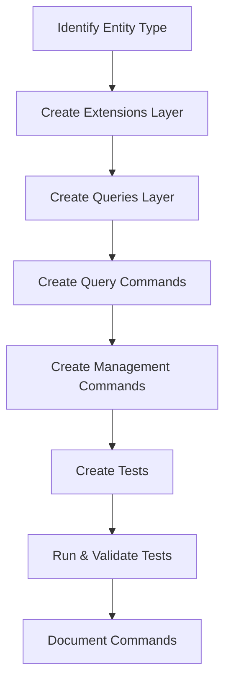

# Implementation Workflow

**Navigation:** [← Back: Architecture Overview](../getting-started/architecture-overview.md) | [Back to Index](../README.md) | [Next: Item Management Example →](item-management-example.md)

---

## Overview

This document provides a step-by-step workflow for implementing new features in the Bannerlord.GameMaster project. Follow this process to ensure consistency with established patterns.

## High-Level Process



## Decision Tree: What Components to Create

```
Do you need to add behavior to a game entity?
├─ YES → Create Extensions class with Flags enum
│
└─ Do you need to search/filter entities?
   ├─ YES → Create Queries class
   │
   └─ Do you need read-only console commands?
      ├─ YES → Create Query Commands class
      │
      └─ Do you need commands that modify game state?
         ├─ YES → Create Management Commands class
         │
         └─ ALWAYS → Create Tests for all commands
```

## Implementation Order

**Always implement in this order:**

1. **Extensions Layer** - Foundation for entity behavior
2. **Queries Layer** - Search and filtering logic
3. **Query Commands Layer** - Read-only console interface
4. **Management Commands Layer** - State modification interface
5. **Testing Layer** - Automated validation

**Why this order?**
- Each layer depends on the previous one
- Bottom-up approach ensures dependencies are available
- Tests validate the entire stack at once

---

## Step-by-Step Implementation Guide

### Step 1: Create Extensions Layer

**Location:** `Bannerlord.GameMaster/{EntityType}/`  
**File:** `{EntityType}Extensions.cs`

**When to Create:**
- Adding a new entity type (Item, Settlement, Party, etc.)
- Need to categorize entities with type flags
- Need reusable formatting or behavior methods

**Standard Methods Required:**

1. **`GetTypes()`** - Returns all applicable type flags for an entity
2. **`HasAllTypes()`** - Checks if entity has ALL specified flags (AND logic)
3. **`HasAnyType()`** - Checks if entity has ANY specified flags (OR logic)
4. **`FormattedDetails()`** - Returns formatted string for display

**Real Examples:**
- [`HeroExtensions.GetHeroTypes()`](../../Bannerlord.GameMaster/Heroes/HeroExtensions.cs:37)
- [`ClanExtensions.HasAllTypes()`](../../Bannerlord.GameMaster/Clans/ClanExtensions.cs:67)
- [`HeroExtensions.FormattedDetails()`](../../Bannerlord.GameMaster/Heroes/HeroExtensions.cs:86)

**Template:** See [Extensions Template](../templates/extensions.md)

---

### Step 2: Create Queries Layer

**Location:** `Bannerlord.GameMaster/{EntityType}/`  
**File:** `{EntityType}Queries.cs`

**When to Create:**
- After Extensions layer is complete
- Need to search entities by name/ID
- Need to filter entities by type flags

**Standard Methods Required:**

1. **`GetById()`** - Find entity by exact ID
2. **`Query{EntityType}s()`** - Main search/filter method
3. **`Parse{EntityType}Type()`** - Convert string to single enum value
4. **`Parse{EntityType}Types()`** - Convert strings to combined flags
5. **`GetFormattedDetails()`** - Format list of entities for display

**Real Examples:**
- [`HeroQueries.QueryHeroes()`](../../Bannerlord.GameMaster/Heroes/HeroQueries.cs:29)
- [`ClanQueries.ParseClanType()`](../../Bannerlord.GameMaster/Clans/ClanQueries.cs:54)

**Template:** See [Queries Template](../templates/queries.md)

---

### Step 3: Create Query Commands Layer

**Location:** `Bannerlord.GameMaster/Console/Query/`  
**File:** `{EntityType}QueryCommands.cs`

**Standard Commands Required:**

1. **`gm.query.{entity}`** - List/search entities with filters
2. **`gm.query.{entity}_any`** - Search with OR logic (optional)
3. **`gm.query.{entity}_info`** - Display detailed entity information

**Real Examples:**
- [`HeroQueryCommands.QueryHeroes()`](../../Bannerlord.GameMaster/Console/Query/HeroQueryCommands.cs:72)
- [`ClanQueryCommands.QueryClanInfo()`](../../Bannerlord.GameMaster/Console/Query/ClanQueryCommands.cs:140)

**Template:** See [Query Commands Template](../templates/query-commands.md)

---

### Step 4: Create Management Commands Layer

**Location:** `Bannerlord.GameMaster/Console/`  
**File:** `{EntityType}ManagementCommands.cs`

**Organize Commands by Region:**
- Property Modification
- Entity Transfer/Assignment
- State Changes
- Relationships
- Creation/Deletion

**Real Examples:**
- [`HeroManagementCommands.SetClan()`](../../Bannerlord.GameMaster/Console/HeroManagementCommands.cs:25)
- [`HeroManagementCommands.SetAge()`](../../Bannerlord.GameMaster/Console/HeroManagementCommands.cs:228)

**Template:** See [Management Commands Template](../templates/management-commands.md)

---

### Step 5: Create Testing Layer

**Location:** `Bannerlord.GameMaster/Console/Testing/`  
**File:** `{EntityType}Tests.cs`

**Test Categories Required:**
- Argument validation tests (missing args, invalid args)
- Error handling tests (invalid IDs, edge cases)
- Success path tests (when possible)

**Real Examples:**
- [`StandardTests.RegisterAll()`](../../Bannerlord.GameMaster/Console/Testing/StandardTests.cs)
- [`NamePriorityTests`](../../Bannerlord.GameMaster/Console/Testing/NamePriorityTests.cs)

**Template:** See [Testing Template](../templates/testing.md)

---

## Validation Chain Order

**Always validate in this order:**

1. Campaign mode
2. Argument count
3. Entity resolution
4. Value validation
5. Business logic validation
6. Execute with error handling

**Example:**
```csharp
// 1. Campaign mode
if (!CommandBase.ValidateCampaignMode(out string error))
    return error;

// 2. Argument count
if (!CommandBase.ValidateArgumentCount(args, 2, usageMessage, out error))
    return error;

// 3. Entity resolution
var (hero, heroError) = CommandBase.FindSingleHero(args[0]);
if (heroError != null) return heroError;

// 4. Value validation
if (!CommandValidator.ValidateIntegerRange(args[1], 0, 100, out int value, out error))
    return CommandBase.FormatErrorMessage(error);

// 5. Business logic (if applicable)
if (hero.IsAlive == false)
    return CommandBase.FormatErrorMessage("Cannot modify dead hero.");

// 6. Execute
return CommandBase.ExecuteWithErrorHandling(() => { ... });
```

---

## Testing Workflow

### Before Committing

1. **Run category tests** for your domain:
   ```
   gm.test.run_category {EntityType}Query
   gm.test.run_category {EntityType}Management
   ```

2. **Run all tests** to catch regressions:
   ```
   gm.test.run_all
   ```

3. **Review test results** in `Console/Testing/Results/`

4. **Fix any failures** before committing

### Test Coverage Checklist

- [ ] All query commands have tests
- [ ] All management commands have tests
- [ ] Argument validation is tested
- [ ] Invalid inputs are tested
- [ ] Error cases are tested
- [ ] Success paths are tested (when feasible)

---

## Best Practices Summary

### Code Organization

- Use regions to group related commands
- Place private helpers at the bottom of files
- Keep files focused (one responsibility per file)

### Naming Conventions

- Files: `PascalCase`
- Classes: `PascalCase`
- Methods: `PascalCase`
- Parameters: `camelCase`
- Console commands: `lowercase.with.dots`

### Error Handling

- Always use `Cmd.Run()` wrapper
- Use `CommandBase.ExecuteWithErrorHandling()` for state changes
- Provide clear, actionable error messages
- Follow validation chain order

### Documentation

- XML comments on all public methods
- Usage messages for all commands
- Clear examples in documentation

---

## Common Pitfalls to Avoid

### ❌ Don't Do This

```csharp
// No Cmd.Run() wrapper
public static string SetAge(List<string> args) { ... }

// Inconsistent error messages
return "Not found\n";

// No error handling
hero.Clan = clan;

// Manual entity lookup
Hero hero = Hero.FindFirst(h => h.StringId == args[0]);
```

### ✅ Do This Instead

```csharp
// Use Cmd.Run() wrapper
public static string SetAge(List<string> args)
{
    return Cmd.Run(args, () => { ... });
}

// Consistent error messages
return CommandBase.FormatErrorMessage("Hero not found.");

// Use error handling
return CommandBase.ExecuteWithErrorHandling(() => {
    hero.Clan = clan;
    return CommandBase.FormatSuccessMessage("Success!");
}, "Failed to transfer hero");

// Use CommandBase finders
var (hero, heroError) = CommandBase.FindSingleHero(args[0]);
if (heroError != null) return heroError;
```

---

## Next Steps

Now that you understand the workflow:

1. **Study** [Item Management Example](item-management-example.md) for a complete implementation
2. **Use** [Templates](../templates/extensions.md) as starting points
3. **Follow** [Best Practices](../guides/best-practices.md) for consistency
4. **Check** [Code Quality Checklist](../reference/code-quality-checklist.md) before committing

---

**Navigation:** [← Back: Architecture Overview](../getting-started/architecture-overview.md) | [Back to Index](../README.md) | [Next: Item Management Example →](item-management-example.md)