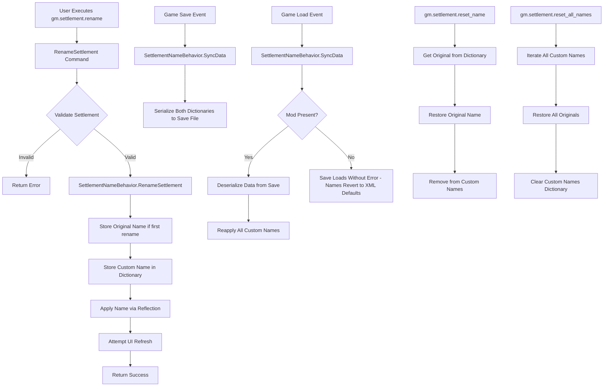

# Settlement Renaming Fix - Architectural Plan (Updated)

## Problem Analysis

### Issues Identified

1. **Immediate UI Update Problem**
   - Query command shows new name instantly
   - Map label doesn't update until player interaction with settlement
   - Game's UI caching system isn't notified of the name change

2. **Save Persistence Problem**
   - Settlement names revert to original after save/load
   - Bannerlord loads settlement data from XML definition files on game load
   - Runtime changes to Settlement.Name field are not automatically persisted
   - Direct reflection approach doesn't integrate with save system

### Root Causes

- **Lack of Save Integration**: Using reflection to set `_name` field bypasses Bannerlord's save/load system
- **No UI Notification**: No mechanism to notify the game engine that a settlement name has changed
- **XML-Based Loading**: Settlement properties are loaded from static XML files, overwriting runtime modifications

## Solution Architecture

### Overview

Implement a custom save/load system using Bannerlord's native patterns:
1. `SaveableTypeDefiner` - Defines custom serializable data types
2. `CampaignBehaviorBase` - Campaign behavior that persists across saves
3. Custom dictionaries to track renamed settlements and original names
4. UI refresh mechanism after rename operations
5. Graceful degradation when mod is removed

### Additional Features

- **Reset Commands**: Restore original names (single or all)
- **Culture Change Command**: Change settlement culture without reflection
- **Save Compatibility**: Graceful handling when mod is removed from saves

### System Design



## Implementation Details

### 1. SaveableTypeDefiner Implementation

**File**: `Bannerlord.GameMaster/Settlements/SettlementSaveDefiner.cs`

```csharp
public class SettlementSaveDefiner : SaveableTypeDefiner
{
    // Unique ID range - must not conflict with other mods
    // Using 900_000_000 range for GameMaster mod
    public SettlementSaveDefiner() : base(900_000_000) { }

    protected override void DefineClassTypes()
    {
        AddClassDefinition(typeof(SettlementNameData), 1);
    }

    protected override void DefineContainerDefinitions()
    {
        ConstructContainerDefinition(typeof(Dictionary<string, string>));
    }
}

[SaveableClass(1)]
public class SettlementNameData
{
    // Maps settlement StringId -> custom name
    [SaveableProperty(1)]
    public Dictionary<string, string> CustomNames { get; set; }
    
    // Maps settlement StringId -> original name (for reset)
    [SaveableProperty(2)]
    public Dictionary<string, string> OriginalNames { get; set; }
    
    public SettlementNameData()
    {
        CustomNames = new Dictionary<string, string>();
        OriginalNames = new Dictionary<string, string>();
    }
}
```

**Save Compatibility Note**: When the mod is removed, Bannerlord's save system gracefully handles missing SaveableTypeDefiner classes. The save will load without errors, but the custom settlement names will simply not be applied, reverting settlements to their XML-defined defaults. No save corruption or crashes will occur.

### 2. CampaignBehaviorBase Implementation

**File**: `Bannerlord.GameMaster/Settlements/SettlementNameBehavior.cs`

Key features:
- Singleton pattern accessible via `Campaign.Current.GetCampaignBehavior<SettlementNameBehavior>()`
- Maintain two dictionaries: CustomNames and OriginalNames
- Apply custom names using reflection
- Persist through save/load cycles
- Reapply names on load and periodically to prevent reversion

Key methods:
- `RenameSettlement(Settlement, string)` - Primary rename API
- `ResetSettlementName(Settlement)` - Restore original name for one settlement
- `ResetAllSettlementNames()` - Restore all settlements to original names
- `SyncData(IDataStore)` - Save/Load handler
- `OnSessionLaunched()` - Apply names after load
- `OnDailyTickSettlement(Settlement)` - Maintain name consistency

**Original Name Tracking**:
```csharp
public void RenameSettlement(Settlement settlement, string newName)
{
    // Store original name on first rename
    if (!_originalNames.ContainsKey(settlement.StringId))
    {
        _originalNames[settlement.StringId] = settlement.Name.ToString();
    }
    
    // Store custom name
    _customNames[settlement.StringId] = newName;
    
    // Apply via reflection
    ApplyNameChange(settlement, newName);
}
```

### 3. UI Refresh Mechanism

**Research and implement** (in priority order):
1. Check if `Settlement` or `MapScene` has update/refresh methods
2. Investigate `MapScreen` or `MapState` for label refresh
3. Try accessing settlement's visual representation (MapMarker)
4. Check if `MobileParty.Position` changes trigger label refresh
5. Investigate if settlement component updates trigger refresh

**Fallback**: If no clean method found, document that:
- Names update correctly in queries immediately
- Names persist through save/load correctly  
- Map labels may require brief wait or settlement interaction to refresh
- This is a Bannerlord engine limitation, not a mod bug

### 4. Settlement Culture Command

**File**: `Bannerlord.GameMaster/Console/SettlementCommands/SettlementManagementCommands.cs`

Add new command without reflection:

```csharp
[CommandLineFunctionality.CommandLineArgumentFunction("set_culture", "gm.settlement")]
public static string SetCulture(List<string> args)
{
    // Usage: gm.settlement.set_culture <settlement> <culture>
    // Example: gm.settlement.set_culture pen empire
    
    // Settlement.Culture is a public property with a setter
    // Can be set directly without reflection:
    settlement.Culture = cultureObject;
}
```

**Note**: The `Settlement.Culture` property has a public setter in Bannerlord, so this command won't require reflection or save persistence system - it works through the game's normal culture management.

### 5. Command Updates

**File**: `Bannerlord.GameMaster/Console/SettlementCommands/SettlementManagementCommands.cs`

#### Updated Commands:
- `gm.settlement.rename <settlement> <new_name>` - Use behavior instead of direct reflection

#### New Commands:
- `gm.settlement.reset_name <settlement>` - Restore original name for one settlement
- `gm.settlement.reset_all_names` - Restore all settlements to original names
- `gm.settlement.set_culture <settlement> <culture>` - Change settlement culture

### 6. SubModule Registration

**File**: `Bannerlord.GameMaster/SubModule.cs`

In `OnGameStart()` method:
```csharp
protected override void OnGameStart(Game game, IGameStarter gameStarterObject)
{
    base.OnGameStart(game, gameStarterObject);
    
    if (game.GameType is Campaign && gameStarterObject is CampaignGameStarter starter)
    {
        // Register the settlement name behavior
        starter.AddBehavior(new SettlementNameBehavior());
    }
}
```

## Save Compatibility & Mod Removal

### How Bannerlord Handles Missing SaveableTypeDefiner

When a save file contains data from a mod that's no longer loaded:
1. **No Crash**: The game doesn't crash or error
2. **Graceful Skip**: Save system skips unknown data types
3. **Data Loss**: Custom data is simply not loaded
4. **Normal Gameplay**: Game continues with default values

### For Settlement Renaming

**When mod is removed**:
- Save loads successfully without errors
- Custom settlement names are not applied
- Settlements revert to their XML-defined default names
- All other game data remains intact
- Player can re-enable mod to restore custom names

**Best Practice**: Document in user guide:
> If you remove the Bannerlord.GameMaster mod after renaming settlements, the custom names will be lost and settlements will revert to their original names. This will not corrupt your save file. Re-enabling the mod will restore custom settlement names from the save data.

## Testing Strategy

### Test Cases

1. **Basic Rename**
   - Rename settlement using command
   - Verify query shows new name immediately
   - Check if map label updates (document behavior)

2. **Original Name Storage**
   - Rename settlement
   - Verify original name is stored
   - Rename again - verify original is not overwritten

3. **Reset Single Settlement**
   - Rename settlement
   - Use reset_name command
   - Verify original name restored
   - Verify removed from custom names

4. **Reset All Settlements**
   - Rename multiple settlements
   - Use reset_all_names command
   - Verify all originals restored

5. **Save Persistence**
   - Rename multiple settlements
   - Save game
   - Load game
   - Verify all names persist in query
   - Verify map labels show custom names

6. **Mod Removal Compatibility**
   - Rename settlements
   - Save game
   - Disable mod
   - Load save
   - Verify: no crash, names reverted to defaults
   - Re-enable mod and reload
   - Verify: custom names restored

7. **Culture Change**
   - Change settlement culture
   - Verify culture updates immediately
   - Save and load
   - Verify culture persists (native game feature)

8. **All Settlement Types**
   - Rename city, castle, village, hideout
   - Test save/load for each
   - Test reset for each

9. **Edge Cases**
   - Empty name string
   - Very long names
   - Special characters
   - Multiple renames of same settlement
   - Reset non-renamed settlement

10. **Long-term Stability**
    - Rename settlements
    - Play through several in-game days
    - Save and load multiple times
    - Verify names don't revert

## Implementation Order

1. Create `SettlementSaveDefiner` class with both dictionaries
2. Create `SettlementNameBehavior` skeleton
3. Implement original name tracking in behavior
4. Implement save serialization in `SyncData()`
5. Implement load deserialization in `SyncData()`
6. Implement name application in `OnSessionLaunched()`
7. Add periodic refresh in `OnDailyTickSettlement()`
8. Register behavior in SubModule
9. Update `RenameSettlement()` command to use behavior
10. Add `ResetSettlementName()` command
11. Add `ResetAllSettlementNames()` command
12. Add `SetCulture()` command
13. Research and implement UI refresh mechanism
14. Test all scenarios including mod removal
15. Document behavior and limitations
16. Create user guide update for wiki

## Success Criteria

- Settlement names persist through save/load cycles
- Query command shows custom names correctly
- Original names stored and can be restored
- Reset commands work for single and all settlements
- Culture change command works without reflection
- No crashes or errors during save/load
- Saves remain compatible when mod is removed
- Behavior integrates cleanly with existing codebase
- Clear error messages for failure cases
- Documentation explains UI update behavior and mod removal

## Files to Create/Modify

### New Files
- `Bannerlord.GameMaster/Settlements/SettlementSaveDefiner.cs` - Save/load type definitions
- `Bannerlord.GameMaster/Settlements/SettlementNameBehavior.cs` - Campaign behavior for name management

### Modified Files
- `Bannerlord.GameMaster/SubModule.cs` - Register behavior
- `Bannerlord.GameMaster/Console/SettlementCommands/SettlementManagementCommands.cs` - Update/add commands
- `Bannerlord.GameMaster/Bannerlord.GameMaster.csproj` - Add new files if needed

### Documentation Files
- `ChangeDocs/Features/SETTLEMENT_NAME_PERSISTENCE_[DATE].md` - Feature documentation
- User wiki update for settlement renaming behavior and commands
- Note about mod removal compatibility in user guide

## Technical Notes

### Why Save Compatibility Works

Bannerlord's save system uses a type ID system:
- Each `SaveableTypeDefiner` has unique ID range
- Save file stores: `[TypeID][Data]`
- On load: If TypeID is registered, deserialize; else skip
- No error thrown for unknown TypeIDs
- Game continues loading other data normally

This design allows mods to be added/removed safely without save corruption.

### Settlement.Culture Property

Unlike `Settlement.Name`, the `Culture` property:
- Has a public setter: `public CultureObject Culture { get; set; }`
- Changes are automatically saved by the game's core save system
- No custom persistence needed
- No reflection required
- Native game feature, fully supported

### UI Refresh Challenge

Settlement map labels are rendered by the game engine's map scene:
- Labels cached for performance
- May not have public refresh API
- Workarounds might involve:
  - Forcing map scene redraw (heavy operation)
  - Manipulating settlement position (hacky)
  - Triggering settlement events (side effects)
- Best approach: Document limitation if no clean method exists
