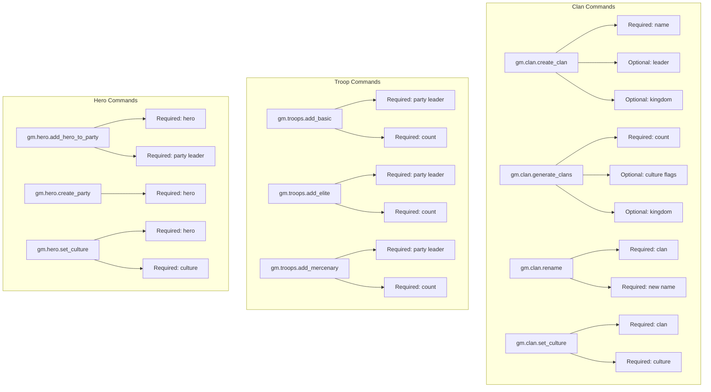

# Command Additions Implementation Plan

## Overview
This plan outlines the addition and update of various commands across the Bannerlord GameMaster console command system, focusing on clan management, troop management, and hero/party management features.

## Command Structure



## Detailed Command Specifications

### 1. Clan Commands

#### 1.1 Update [`gm.clan.create_clan`](Bannerlord.GameMaster/Console/ClanCommands/ClanGenerationCommands.cs:26)
**Current State:** Requires clanName and leaderHero, optional kingdom  
**New State:** Requires clanName only, optional leader (generates if null), optional kingdom

**Parameters:**
- `clanName` (required): Name of the clan to create
- `leaderHero` (optional): Hero to assign as clan leader. If null, generates a new hero
- `kingdom` (optional): Kingdom to join after creation

**Usage Examples:**
```
gm.clan.create_clan Highlanders
gm.clan.create_clan 'The Highland Clan' derthert
gm.clan.create_clan NewClan myHero empire
```

**Implementation Notes:**
- Update argument validation to accept 1-3 arguments instead of minimum 2
- Leverage existing [`ClanGenerator.CreateClan`](Bannerlord.GameMaster/Clans/ClanGenerator.cs:40) method which already handles null leader
- Update usage message and examples

#### 1.2 Add [`gm.clan.generate_clans`](Bannerlord.GameMaster/Console/ClanCommands/ClanGenerationCommands.cs)
**Purpose:** Generate multiple clans at once with random names from culture lists

**Parameters:**
- `count` (required): Number of clans to generate (1-50)
- `cultures` (optional): Culture flags using same parsing as hero commands. Defaults to `main_cultures`
- `kingdom` (optional): Kingdom for all generated clans to join

**Usage Examples:**
```
gm.clan.generate_clans 5
gm.clan.generate_clans 10 vlandia;battania
gm.clan.generate_clans 3 main_cultures empire
gm.clan.generate_clans 7 aserai;khuzait sturgia
```

**Implementation Notes:**
- Use [`FlagParser.ParseCultureArgument`](Bannerlord.GameMaster/Console/Common/FlagParser.cs) for culture parsing
- Leverage [`ClanGenerator.GenerateClans`](Bannerlord.GameMaster/Clans/ClanGenerator.cs:110) method
- Format output using [`ClanQueries.GetFormattedDetails`](Bannerlord.GameMaster/Clans/ClanQueries.cs)

#### 1.3 Add [`gm.clan.rename`](Bannerlord.GameMaster/Console/ClanCommands/ClanManagementCommands.cs)
**Purpose:** Rename an existing clan

**Parameters:**
- `clan` (required): Clan query to find the clan
- `newName` (required): New name for the clan (use single quotes for multi-word names)

**Usage Examples:**
```
gm.clan.rename empire_south 'Southern Empire Lords'
gm.clan.rename clan_1 NewClanName
```

**Implementation Notes:**
- Use [`CommandBase.FindSingleClan`](Bannerlord.GameMaster/Console/Common/CommandBase.cs) for clan lookup
- Use [`ClanExtensions.SetStringName`](Bannerlord.GameMaster/Clans/ClanExtensions.cs:125) extension method
- Display previous and new name in success message

#### 1.4 Add [`gm.clan.set_culture`](Bannerlord.GameMaster/Console/ClanCommands/ClanManagementCommands.cs)
**Purpose:** Change a clan's culture

**Parameters:**
- `clan` (required): Clan query to find the clan
- `culture` (required): Culture string ID (e.g., vlandia, empire, aserai)

**Usage Examples:**
```
gm.clan.set_culture empire_south vlandia
gm.clan.set_culture my_clan battania
```

**Implementation Notes:**
- Parse culture using single culture name lookup
- Set `clan.Culture` property
- Also update `clan.BasicTroop` to match new culture
- Display previous and new culture in success message

### 2. Troop Commands

#### 2.1 Add [`gm.troops.add_basic`](Bannerlord.GameMaster/Console/TroopCommands/TroopManagementCommands.cs)
**Purpose:** Add basic tier troops from party leader's culture to their party

**Parameters:**
- `partyLeader` (required): Hero who leads the party
- `count` (required): Number of basic troops to add (1-10000)

**Usage Examples:**
```
gm.troops.add_basic derthert 50
gm.troops.add_basic player 100
```

**Implementation Notes:**
- Verify hero has a party using `hero.PartyBelongedTo`
- Verify hero is party leader: `hero.PartyBelongedTo.LeaderHero == hero`
- Use [`MobilePartyExtensions.AddBasicTroops`](Bannerlord.GameMaster/Party/MobilePartyExtensions.cs:36)
- Display troop type added based on hero's culture basic troop

#### 2.2 Add [`gm.troops.add_elite`](Bannerlord.GameMaster/Console/TroopCommands/TroopManagementCommands.cs)
**Purpose:** Add elite tier troops from party leader's culture to their party

**Parameters:**
- `partyLeader` (required): Hero who leads the party
- `count` (required): Number of elite troops to add (1-10000)

**Usage Examples:**
```
gm.troops.add_elite derthert 30
gm.troops.add_elite player 50
```

**Implementation Notes:**
- Same validation as add_basic
- Use [`MobilePartyExtensions.AddEliteTroops`](Bannerlord.GameMaster/Party/MobilePartyExtensions.cs:45)

#### 2.3 Add [`gm.troops.add_mercenary`](Bannerlord.GameMaster/Console/TroopCommands/TroopManagementCommands.cs)
**Purpose:** Add random mercenary troops from party leader's culture to their party

**Parameters:**
- `partyLeader` (required): Hero who leads the party
- `count` (required): Number of mercenary troops to add (1-10000)

**Usage Examples:**
```
gm.troops.add_mercenary derthert 20
gm.troops.add_mercenary player 40
```

**Implementation Notes:**
- Same validation as add_basic and add_elite
- Use [`MobilePartyExtensions.AddMercenaryTroops`](Bannerlord.GameMaster/Party/MobilePartyExtensions.cs:54)
- Note: Mercenaries are randomly selected from culture's mercenary roster

### 3. Hero Commands

#### 3.1 Add [`gm.hero.add_hero_to_party`](Bannerlord.GameMaster/Console/HeroCommands/HeroManagementCommands.cs)
**Purpose:** Add a hero as a companion to another hero's party. Hero leaves their current party if already in one.

**Parameters:**
- `hero` (required): Hero to add to party
- `partyLeader` (required): Hero who leads the target party

**Usage Examples:**
```
gm.hero.add_hero_to_party companion_1 player
gm.hero.add_hero_to_party wanderer_1 derthert
```

**Implementation Notes:**
- Validate party leader has a party and is actually the leader
- If hero is already in a party, remove them first:
  - If hero leads their own party, handle party dissolution
  - If hero is a member, remove from roster
- Set hero's clan to match party leader's clan
- Use [`MobilePartyExtensions.AddCompanionToParty`](Bannerlord.GameMaster/Party/MobilePartyExtensions.cs:14)
- Display previous party (if any) and new party in message

#### 3.2 Add [`gm.hero.create_party`](Bannerlord.GameMaster/Console/HeroCommands/HeroManagementCommands.cs)
**Purpose:** Create a party for any hero using their last known location or home settlement

**Parameters:**
- `hero` (required): Hero to create party for

**Usage Examples:**
```
gm.hero.create_party lord_1_1
gm.hero.create_party wanderer_1
```

**Implementation Notes:**
- Check if hero already has a party, error if they do
- Determine spawn settlement:
  1. Use `hero.LastSeenPlace` if available and is a settlement
  2. Fallback to [`hero.GetHomeOrAlternativeSettlement()`](Bannerlord.GameMaster/Heroes/HeroExtensions.cs:138)
- Use [`HeroExtensions.CreateParty`](Bannerlord.GameMaster/Heroes/HeroExtensions.cs:107)
- Party automatically gets 10 basic troops and 20000 trade gold
- Display party name, location, and initial roster

#### 3.3 Add [`gm.hero.set_culture`](Bannerlord.GameMaster/Console/HeroCommands/HeroManagementCommands.cs)
**Purpose:** Change a hero's culture

**Parameters:**
- `hero` (required): Hero to change culture
- `culture` (required): Culture string ID (e.g., vlandia, empire, aserai)

**Usage Examples:**
```
gm.hero.set_culture lord_1_1 vlandia
gm.hero.set_culture companion_1 battania
```

**Implementation Notes:**
- Parse culture using `MBObjectManager.Instance.GetObject<CultureObject>`
- Validate culture exists
- Set `hero.Culture` property
- Display previous and new culture in success message
- Note: This does not change equipment or troops, only the culture property

## Implementation Order

The todo list should be executed in this order to minimize dependencies:

1. Update [`create_clan`](Bannerlord.GameMaster/Console/ClanCommands/ClanGenerationCommands.cs:26) - Foundation for other clan commands
2. Add [`generate_clans`](Bannerlord.GameMaster/Console/ClanCommands/ClanGenerationCommands.cs) - Uses updated create_clan
3. Add [`rename_clan`](Bannerlord.GameMaster/Console/ClanCommands/ClanManagementCommands.cs) - Independent
4. Add troop commands ([`add_basic`](Bannerlord.GameMaster/Console/TroopCommands/TroopManagementCommands.cs), [`add_elite`](Bannerlord.GameMaster/Console/TroopCommands/TroopManagementCommands.cs), [`add_mercenary`](Bannerlord.GameMaster/Console/TroopCommands/TroopManagementCommands.cs)) - Can be done together
5. Add [`add_hero_to_party`](Bannerlord.GameMaster/Console/HeroCommands/HeroManagementCommands.cs) - Complex party management
6. Add [`create_party`](Bannerlord.GameMaster/Console/HeroCommands/HeroManagementCommands.cs) - Uses party extensions
7. Add culture commands ([`hero.set_culture`](Bannerlord.GameMaster/Console/HeroCommands/HeroManagementCommands.cs), [`clan.set_culture`](Bannerlord.GameMaster/Console/ClanCommands/ClanManagementCommands.cs)) - Can be done together

## Key Extension Methods to Use

- [`ClanExtensions.SetStringName`](Bannerlord.GameMaster/Clans/ClanExtensions.cs:125) - For clan renaming
- [`ClanExtensions.SetClanTier`](Bannerlord.GameMaster/Clans/ClanExtensions.cs:99) - Already used in create_clan
- [`MobilePartyExtensions.AddBasicTroops`](Bannerlord.GameMaster/Party/MobilePartyExtensions.cs:36) - For basic troop addition
- [`MobilePartyExtensions.AddEliteTroops`](Bannerlord.GameMaster/Party/MobilePartyExtensions.cs:45) - For elite troop addition
- [`MobilePartyExtensions.AddMercenaryTroops`](Bannerlord.GameMaster/Party/MobilePartyExtensions.cs:54) - For mercenary troop addition
- [`MobilePartyExtensions.AddCompanionToParty`](Bannerlord.GameMaster/Party/MobilePartyExtensions.cs:14) - For adding heroes to parties
- [`HeroExtensions.CreateParty`](Bannerlord.GameMaster/Heroes/HeroExtensions.cs:107) - For party creation
- [`HeroExtensions.GetHomeOrAlternativeSettlement`](Bannerlord.GameMaster/Heroes/HeroExtensions.cs:138) - For settlement fallback
- [`HeroExtensions.SetStringName`](Bannerlord.GameMaster/Heroes/HeroExtensions.cs:281) - For hero renaming (existing)

## Testing Considerations

After implementation, each command should be tested for:
- Valid input scenarios
- Invalid input handling (wrong argument counts, invalid IDs, etc.)
- Edge cases (e.g., hero already has party, party leader not actually leading party)
- Proper error messages
- Success message formatting consistency with existing commands

## Code Style Guidelines

Follow existing patterns in the codebase:
- Use `Cmd.Run(args, () => { })` wrapper for all commands
- Use `CommandBase.ValidateCampaignMode` first
- Use `CommandValidator.CreateUsageMessage` for help text
- Use `CommandBase.ValidateArgumentCount` for arg count validation
- Use `CommandBase.ExecuteWithErrorHandling` for execution
- Use `CommandBase.FormatSuccessMessage` and `CommandBase.FormatErrorMessage` for output
- Include MARK comments for command sections (e.g., `//MARK: command_name`)
- Provide comprehensive usage examples in help text
