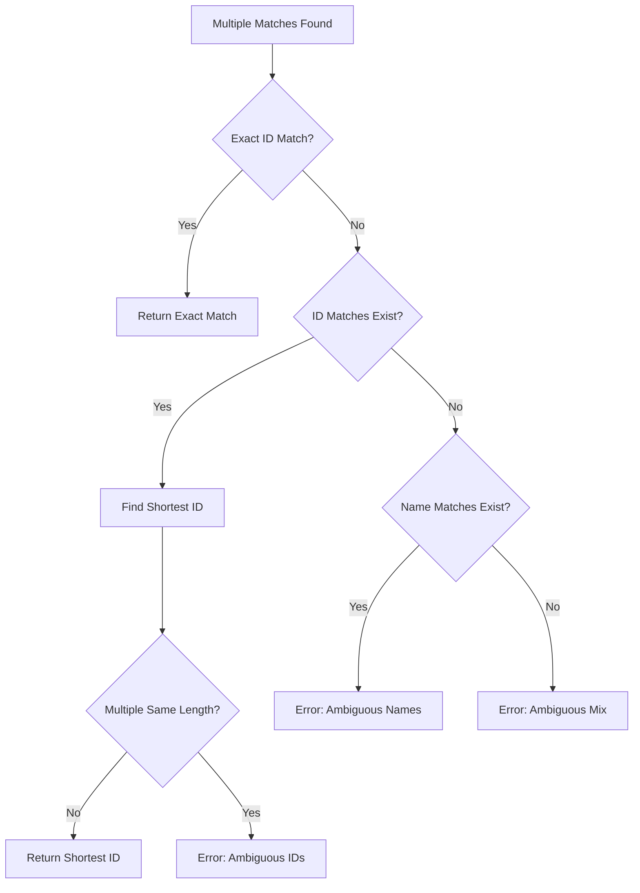

# ID Matching Collision Fix - Design Document

## Executive Summary

This design addresses the ID matching collision issue in [`CommandBase.cs`](../Bannerlord.GameMaster/Console/Common/CommandBase.cs) where queries that partially match multiple entity IDs incorrectly return an ambiguity error instead of selecting the most specific (shortest) ID match.

**Target Methods:**
- [`FindSingleHero()`](../Bannerlord.GameMaster/Console/Common/CommandBase.cs:21-36)
- [`FindSingleClan()`](../Bannerlord.GameMaster/Console/Common/CommandBase.cs:41-56)
- [`FindSingleKingdom()`](../Bannerlord.GameMaster/Console/Common/CommandBase.cs:61-76)

## Current Behavior Analysis

### Query Methods
The underlying query methods ([`HeroQueries.QueryHeroes()`](../Bannerlord.GameMaster/Heroes/HeroQueries.cs:29-67), [`ClanQueries.QueryClans()`](../Bannerlord.GameMaster/Clans/ClanQueries.cs:26-49), [`KingdomQueries.QueryKingdoms()`](../Bannerlord.GameMaster/Kingdoms/KingdomQueries.cs:26-49)) match entities where:
- **Name contains query** (case-insensitive) OR
- **ID contains query** (case-insensitive)

Example with query "example_12_1":
```
Matches:
  1. Hero ID: "example_12_1"      Name: "John Doe"       ← Exact ID match
  2. Hero ID: "example_12_1_2"    Name: "Jane Smith"     ← Partial ID match
  3. Hero ID: "other_hero"        Name: "example_12_1"   ← Name match
```

### Current Problem
[`CommandBase.FindSingle*()`](../Bannerlord.GameMaster/Console/Common/CommandBase.cs) methods treat all matches identically:
```csharp
if (matchedHeroes.Count > 1)
{
    return (null, $"Error: Found {matchedHeroes.Count} heroes matching query '{query}'...");
}
```

This returns an error even when "example_12_1" is the most specific ID match.

---

## Solution Design

### Core Algorithm: Smart Match Selection

The solution implements a three-tier prioritization system:

```
Priority 1: EXACT ID MATCH
  ↓ (if none found)
Priority 2: SHORTEST PARTIAL ID MATCH
  ↓ (if none found or multiple with same length)
Priority 3: NAME MATCHES (error if multiple)
```

### Detailed Algorithm Pseudocode

```
FUNCTION ResolveMultipleMatches(matches, query):
    IF matches.Count == 0:
        RETURN (null, "Not found error")
    
    IF matches.Count == 1:
        RETURN (matches[0], null)
    
    // Separate matches by type
    idMatches = []
    nameMatches = []
    
    FOR EACH entity IN matches:
        IF entity.StringId.Contains(query, CaseInsensitive):
            ADD entity TO idMatches
        ELSE IF entity.Name.Contains(query, CaseInsensitive):
            ADD entity TO nameMatches
        // Note: An entity can be in both lists
    
    // Priority 1: Check for exact ID match
    FOR EACH entity IN idMatches:
        IF entity.StringId.Equals(query, CaseInsensitive):
            RETURN (entity, null)  // Exact match wins immediately
    
    // Priority 2: Use shortest ID match if available
    IF idMatches.Count > 0:
        shortestMatch = idMatches.OrderBy(e => e.StringId.Length).First()
        
        // Check if there are multiple IDs with the same shortest length
        allShortestMatches = idMatches.Where(e => e.StringId.Length == shortestMatch.StringId.Length)
        
        IF allShortestMatches.Count == 1:
            RETURN (shortestMatch, null)
        ELSE:
            // Multiple IDs with same length - still ambiguous
            RETURN (null, "Multiple ID matches with same length error")
    
    // Priority 3: Only name matches remain
    IF nameMatches.Count > 0:
        RETURN (null, "Multiple name matches error")
    
    // Should never reach here, but safety fallback
    RETURN (null, "Ambiguous matches error")
```

### Algorithm Decision Tree



---

## Implementation Architecture

### Recommendation: Shared Helper Method

**Decision: Create a generic helper method** to avoid code duplication across the three `FindSingle*` methods.

**Rationale:**
1. **DRY Principle**: All three methods follow identical logic patterns
2. **Consistency**: Ensures uniform behavior across Hero, Clan, and Kingdom queries
3. **Maintainability**: Single location for algorithm updates and bug fixes
4. **Testability**: Can unit test the core logic independently

### Proposed Code Structure

#### 1. New Generic Helper Method

```csharp
/// <summary>
/// Resolves a single entity from multiple matches using smart matching logic.
/// Prioritizes: 1) Exact ID match, 2) Shortest ID match, 3) Error on name-only matches
/// </summary>
/// <typeparam name="T">Entity type (Hero, Clan, or Kingdom)</typeparam>
/// <param name="matches">List of matched entities</param>
/// <param name="query">Original query string</param>
/// <param name="getEntityId">Function to extract StringId from entity</param>
/// <param name="getEntityName">Function to extract Name from entity</param>
/// <param name="formatDetails">Function to format entity list for error messages</param>
/// <param name="entityTypeName">Name of entity type for error messages (e.g., "hero")</param>
/// <returns>Tuple of (selected entity or null, error message or null)</returns>
private static (T entity, string error) ResolveMultipleMatches<T>(
    List<T> matches,
    string query,
    Func<T, string> getEntityId,
    Func<T, string> getEntityName,
    Func<List<T>, string> formatDetails,
    string entityTypeName) where T : class
{
    // Algorithm implementation here
}
```

#### 2. Updated FindSingleHero Method

```csharp
public static (Hero hero, string error) FindSingleHero(string query)
{
    List<Hero> matchedHeroes = HeroQueries.QueryHeroes(query);

    if (matchedHeroes == null || matchedHeroes.Count == 0)
        return (null, $"Error: No hero matching query '{query}' found.\n");

    if (matchedHeroes.Count == 1)
        return (matchedHeroes[0], null);

    // Use smart matching for multiple results
    return ResolveMultipleMatches(
        matches: matchedHeroes,
        query: query,
        getEntityId: h => h.StringId,
        getEntityName: h => h.Name?.ToString() ?? "",
        formatDetails: HeroQueries.GetFormattedDetails,
        entityTypeName: "hero");
}
```

#### 3. Updated FindSingleClan Method

```csharp
public static (Clan clan, string error) FindSingleClan(string query)
{
    List<Clan> matchedClans = ClanQueries.QueryClans(query);

    if (matchedClans == null || matchedClans.Count == 0)
        return (null, $"Error: No clan matching query '{query}' found.\n");

    if (matchedClans.Count == 1)
        return (matchedClans[0], null);

    // Use smart matching for multiple results
    return ResolveMultipleMatches(
        matches: matchedClans,
        query: query,
        getEntityId: c => c.StringId,
        getEntityName: c => c.Name?.ToString() ?? "",
        formatDetails: ClanQueries.GetFormattedDetails,
        entityTypeName: "clan");
}
```

#### 4. Updated FindSingleKingdom Method

```csharp
public static (Kingdom kingdom, string error) FindSingleKingdom(string query)
{
    List<Kingdom> matchedKingdoms = KingdomQueries.QueryKingdoms(query);

    if (matchedKingdoms == null || matchedKingdoms.Count == 0)
        return (null, $"Error: No kingdom matching query '{query}' found.\n");

    if (matchedKingdoms.Count == 1)
        return (matchedKingdoms[0], null);

    // Use smart matching for multiple results
    return ResolveMultipleMatches(
        matches: matchedKingdoms,
        query: query,
        getEntityId: k => k.StringId,
        getEntityName: k => k.Name?.ToString() ?? "",
        formatDetails: KingdomQueries.GetFormattedDetails,
        entityTypeName: "kingdom");
}
```

### Alternative: Independent Methods

If the team prefers to avoid generics or keep methods independent:
- Implement the algorithm separately in each `FindSingle*` method
- Use copy-paste with appropriate type changes
- **Pros**: Simpler, no generics
- **Cons**: Code duplication, maintenance burden

**Recommendation**: Use the generic helper method unless there's a compelling reason not to.

---

## Edge Cases & Error Scenarios

### 1. Multiple Exact ID Matches (Should Not Occur)

**Scenario**: Two entities with identical StringIds
```
Query: "hero_1"
Matches:
  - Hero 1: StringId = "hero_1"
  - Hero 2: StringId = "hero_1"
```

**Handling**: 
- This should be impossible in well-formed game data (IDs should be unique)
- If it occurs, algorithm returns the first exact match found
- Consider adding a warning log if multiple exact matches detected

### 2. Multiple IDs with Same Shortest Length

**Scenario**: Query matches multiple IDs, all with equal length
```
Query: "12"
Matches:
  - Hero A: StringId = "hero_12_a" (length 10)
  - Hero B: StringId = "hero_12_b" (length 10)
```

**Handling**: 
- Return error with list of ambiguous matches
- User must provide more specific query
- Error message should clearly indicate these are ID matches

### 3. Mixed ID and Name Matches

**Scenario**: Query matches both IDs and names
```
Query: "storm"
Matches:
  - Clan A: StringId = "clan_storm" (ID match)
  - Clan B: StringId = "clan_x", Name = "The Stormborn" (Name match)
```

**Handling**: 
- Prioritize ID match (Clan A)
- Name matches ignored when ID matches exist
- This is intentional and correct behavior

### 4. Empty or Null StringId/Name

**Scenario**: Entity has null or empty StringId or Name
```
Match: Hero with StringId = null or "", Name = "Valid Name"
```

**Handling**: 
- Null-safe string operations (use `?.Contains()` or null checks)
- Empty IDs should not match queries (already filtered by Query methods)
- If somehow included, treat as name-only match

### 5. Case Sensitivity Edge Cases

**Scenario**: Query differs only in case
```
Query: "HERO_1"
Matches: StringId = "hero_1"
```

**Handling**: 
- All comparisons should be case-insensitive (`OrdinalIgnoreCase`)
- Consistent with existing Query method behavior

### 6. Whitespace in IDs or Queries

**Scenario**: Query or ID contains whitespace
```
Query: " hero 1 "
ID: "hero_1"
```

**Handling**: 
- No special trimming (maintain current behavior)
- If Query methods don't trim, neither should we
- Consider recommending trim in Query methods if this is problematic

### 7. Unicode/Special Characters

**Scenario**: Query or ID contains non-ASCII characters
```
Query: "héro_1"
ID: "hero_1" or "héro_1"
```

**Handling**: 
- Use culture-insensitive comparison (`OrdinalIgnoreCase`)
- Consistent with existing string comparison behavior

### 8. Very Long ID Lists

**Scenario**: Query matches 100+ entities
```
Query: "a"
Matches: 500 heroes with 'a' in name or ID
```

**Handling**: 
- Performance should be acceptable (single LINQ pass)
- OrderBy operation is O(n log n)
- Consider performance testing with large datasets

---

## Backward Compatibility

### Changes in Behavior

**Before Fix:**
```
Query: "example_12_1"
Matches: "example_12_1", "example_12_1_2"
Result: Error - "Found 2 heroes, please be more specific"
```

**After Fix:**
```
Query: "example_12_1"
Matches: "example_12_1", "example_12_1_2"
Result: Success - Returns "example_12_1" (shortest ID)
```

### Impact Assessment

**Positive Changes:**
- ✅ More intuitive behavior for ID-based queries
- ✅ Reduces frustration when exact/shortest ID exists
- ✅ Maintains strict behavior for name-only queries

**Potential Concerns:**
- ⚠️ Users may have developed workarounds for current behavior
- ⚠️ Scripts might rely on error behavior for validation
- ⚠️ Documentation and tutorials may need updates

**Mitigation:**
- Announce change in release notes
- Provide examples of new behavior
- Consider a transitional period with warnings

### Breaking Changes

**None Expected** - This is a bug fix that makes behavior more intuitive. The change only affects cases that currently return errors, not successful queries.

---

## Testing Recommendations

### Unit Tests for ResolveMultipleMatches

Create a comprehensive test suite for the core algorithm:

#### Test Category 1: Exact Match Priority

```csharp
[Fact]
public void ExactIdMatch_ShouldReturnImmediately()
{
    // Arrange: Multiple matches including exact
    var matches = new List<TestEntity>
    {
        new TestEntity { Id = "hero_1", Name = "Bob" },
        new TestEntity { Id = "hero_12", Name = "Alice" },
        new TestEntity { Id = "hero_123", Name = "Charlie" }
    };

    // Act: Query for exact ID
    var (result, error) = ResolveMultipleMatches(
        matches, "hero_12", 
        e => e.Id, e => e.Name, 
        FormatTestDetails, "test");

    // Assert
    Assert.NotNull(result);
    Assert.Null(error);
    Assert.Equal("hero_12", result.Id);
}
```

#### Test Category 2: Shortest ID Selection

```csharp
[Fact]
public void MultiplePartialIdMatches_ShouldSelectShortest()
{
    // Arrange
    var matches = new List<TestEntity>
    {
        new TestEntity { Id = "hero_12_1_extended", Name = "Bob" },
        new TestEntity { Id = "hero_12_1", Name = "Alice" },
        new TestEntity { Id = "hero_12_1_2", Name = "Charlie" }
    };

    // Act
    var (result, error) = ResolveMultipleMatches(
        matches, "hero_12_1",
        e => e.Id, e => e.Name,
        FormatTestDetails, "test");

    // Assert
    Assert.NotNull(result);
    Assert.Null(error);
    Assert.Equal("hero_12_1", result.Id);
}
```

#### Test Category 3: Ambiguous ID Matches

```csharp
[Fact]
public void MultipleSameLengthIdMatches_ShouldReturnError()
{
    // Arrange
    var matches = new List<TestEntity>
    {
        new TestEntity { Id = "hero_12_a", Name = "Bob" },
        new TestEntity { Id = "hero_12_b", Name = "Alice" }
    };

    // Act
    var (result, error) = ResolveMultipleMatches(
        matches, "hero_12",
        e => e.Id, e => e.Name,
        FormatTestDetails, "test");

    // Assert
    Assert.Null(result);
    Assert.NotNull(error);
    Assert.Contains("ambiguous", error.ToLower());
}
```

#### Test Category 4: Name-Only Matches

```csharp
[Fact]
public void MultipleNameMatches_ShouldReturnError()
{
    // Arrange
    var matches = new List<TestEntity>
    {
        new TestEntity { Id = "hero_a", Name = "Storm King" },
        new TestEntity { Id = "hero_b", Name = "Storm Queen" }
    };

    // Act
    var (result, error) = ResolveMultipleMatches(
        matches, "Storm",
        e => e.Id, e => e.Name,
        FormatTestDetails, "test");

    // Assert
    Assert.Null(result);
    Assert.NotNull(error);
    Assert.Contains("name", error.ToLower());
}
```

#### Test Category 5: Mixed ID and Name Matches

```csharp
[Fact]
public void MixedIdAndNameMatches_ShouldPrioritizeId()
{
    // Arrange
    var matches = new List<TestEntity>
    {
        new TestEntity { Id = "storm_clan", Name = "The Warriors" },
        new TestEntity { Id = "other_clan", Name = "Storm Riders" }
    };

    // Act
    var (result, error) = ResolveMultipleMatches(
        matches, "storm",
        e => e.Id, e => e.Name,
        FormatTestDetails, "test");

    // Assert
    Assert.NotNull(result);
    Assert.Null(error);
    Assert.Equal("storm_clan", result.Id);
}
```

#### Test Category 6: Edge Cases

```csharp
[Fact]
public void NullOrEmptyStrings_ShouldHandleGracefully()
{
    var matches = new List<TestEntity>
    {
        new TestEntity { Id = null, Name = "Valid" },
        new TestEntity { Id = "", Name = null },
        new TestEntity { Id = "valid_id", Name = "Valid Name" }
    };

    var (result, error) = ResolveMultipleMatches(
        matches, "valid",
        e => e.Id ?? "", e => e.Name ?? "",
        FormatTestDetails, "test");

    Assert.NotNull(result);
    Assert.Equal("valid_id", result.Id);
}

[Fact]
public void CaseInsensitive_ShouldMatchRegardlessOfCase()
{
    var matches = new List<TestEntity>
    {
        new TestEntity { Id = "HERO_1", Name = "Bob" },
        new TestEntity { Id = "hero_12", Name = "Alice" }
    };

    var (result, error) = ResolveMultipleMatches(
        matches, "hero_1",
        e => e.Id, e => e.Name,
        FormatTestDetails, "test");

    Assert.NotNull(result);
    Assert.Equal("HERO_1", result.Id);
}
```

### Integration Tests

Test the actual `FindSingle*` methods with real game entities:

```csharp
[Fact]
public void FindSingleHero_WithPartialIdMatch_ShouldSelectShortest()
{
    // Requires actual game data or mocked Campaign
    // Test with real Hero entities
}

[Fact]
public void FindSingleClan_WithExactIdMatch_ShouldReturnExact()
{
    // Test with real Clan entities
}

[Fact]
public void FindSingleKingdom_WithNameMatch_ShouldReturnError()
{
    // Test with real Kingdom entities
}
```

### Manual Testing Scenarios

Create test commands to verify behavior:

```
Test 1: Exact ID Match
Command: gm.hero.setgold hero_1 1000
Expected: Finds "hero_1" even if "hero_12", "hero_123" exist

Test 2: Shortest ID Match
Command: gm.clan.addgold clan_12_1 500
Expected: Finds "clan_12_1" instead of "clan_12_1_2"

Test 3: Ambiguous Name Match
Command: gm.hero.kill storm
Expected: Error if multiple heroes have "storm" in name

Test 4: Mixed Match Priority
Command: gm.kingdom.declare.war empire
Expected: Finds kingdom with "empire" in ID, ignores name matches
```

### Performance Testing

```csharp
[Fact]
public void ResolveMultipleMatches_WithLargeDataset_ShouldPerformWell()
{
    // Create 1000+ entity matches
    var matches = Enumerable.Range(1, 1000)
        .Select(i => new TestEntity { 
            Id = $"hero_{i}_extended_name", 
            Name = $"Hero {i}" 
        })
        .ToList();

    // Add the target match
    matches.Add(new TestEntity { Id = "hero_1", Name = "Target" });

    var stopwatch = Stopwatch.StartNew();
    var (result, error) = ResolveMultipleMatches(
        matches, "hero_1",
        e => e.Id, e => e.Name,
        FormatTestDetails, "test");
    stopwatch.Stop();

    Assert.NotNull(result);
    Assert.True(stopwatch.ElapsedMilliseconds < 100); // Should be fast
}
```

---

## Error Message Improvements

### Current Error Messages

```
Error: Found 2 heroes matching query 'example_12_1':
  - Hero ID: example_12_1, Name: John Doe
  - Hero ID: example_12_1_2, Name: Jane Smith
Please use a more specific name or ID.
```

### Proposed Error Messages

#### For Ambiguous ID Matches

```
Error: Found 2 heroes with IDs matching query 'hero_12':
  - Hero ID: hero_12_a, Name: John Doe
  - Hero ID: hero_12_b, Name: Jane Smith
These IDs have the same length and cannot be automatically selected.
Please use a more specific ID (e.g., 'hero_12_a' or 'hero_12_b').
```

#### For Ambiguous Name Matches

```
Error: Found 2 heroes with names matching query 'storm':
  - Hero ID: hero_1, Name: Storm King
  - Hero ID: hero_2, Name: Storm Queen
Please use a more specific name or use their IDs ('hero_1' or 'hero_2').
```

#### Success with Smart Selection (Debug/Verbose Mode)

```
Info: Selected hero 'example_12_1' from 2 matches (shortest ID).
Success: Set gold for hero 'example_12_1' to 1000.
```

---

## Implementation Checklist

- [ ] Create `ResolveMultipleMatches<T>` generic helper method
- [ ] Update `FindSingleHero()` to use new helper
- [ ] Update `FindSingleClan()` to use new helper
- [ ] Update `FindSingleKingdom()` to use new helper
- [ ] Implement improved error messages
- [ ] Write unit tests for `ResolveMultipleMatches`
- [ ] Write integration tests for `FindSingle*` methods
- [ ] Create manual test scenarios
- [ ] Run performance tests with large datasets
- [ ] Update documentation
- [ ] Add release notes entry
- [ ] Consider adding optional verbose logging

---

## Future Enhancements

### 1. Fuzzy Matching

Consider implementing fuzzy string matching for typos:
```
Query: "exmple_12_1" (typo)
Match: "example_12_1"
```

### 2. Weighted Scoring System

Instead of binary ID/name matching, use a scoring system:
- Exact ID match: 100 points
- Exact name match: 90 points
- Partial ID match: 50 points
- Partial name match: 25 points

### 3. User Preference Configuration

Allow users to configure matching behavior:
```ini
[Matching]
PreferIDMatches=true
RequireExactMatch=false
CaseSensitive=false
```

### 4. Match Preview Mode

Add a command to preview matches without executing:
```
Command: gm.hero.preview example_12
Output: Would select: hero ID 'example_12_1' (2 matches found)
```

---

## Conclusion

This design provides a robust, maintainable solution to the ID matching collision problem. The smart matching algorithm prioritizes more specific matches while maintaining backward compatibility for most use cases. The generic helper method ensures consistency across all entity types while remaining extensible for future enhancements.

The solution strikes a balance between user-friendliness (automatically selecting the most likely match) and safety (erroring on truly ambiguous cases), making the command system more intuitive without sacrificing reliability.

---

## Appendix: Example Scenarios

### Scenario A: Typical Usage (IMPROVED)

**Before Fix:**
```
> gm.hero.setgold example_12_1 1000
Error: Found 2 heroes matching query 'example_12_1':
  - Hero ID: example_12_1, Name: John
  - Hero ID: example_12_1_2, Name: Jane
Please use a more specific name or ID.
```

**After Fix:**
```
> gm.hero.setgold example_12_1 1000
Success: Set gold for hero 'example_12_1' to 1000.
```

### Scenario B: Truly Ambiguous (NO CHANGE)

**Before Fix:**
```
> gm.clan.addgold storm 500
Error: Found 2 clans matching query 'storm':
  - Clan ID: clan_a, Name: Storm Riders
  - Clan ID: clan_b, Name: Storm Warriors
Please use a more specific name or ID.
```

**After Fix:**
```
> gm.clan.addgold storm 500
Error: Found 2 clans with names matching query 'storm':
  - Clan ID: clan_a, Name: Storm Riders
  - Clan ID: clan_b, Name: Storm Warriors
Please use a more specific name or use their IDs.
```
*(Behavior unchanged, error message clarified)*

### Scenario C: Mixed Matches (IMPROVED)

**Before Fix:**
```
> gm.kingdom.declare.war empire 500
Error: Found 3 kingdoms matching query 'empire':
  - Kingdom ID: empire, Name: The Great Empire
  - Kingdom ID: empire_north, Name: Northern Realm
  - Kingdom ID: other_kingdom, Name: Empire of the East
Please use a more specific name or ID.
```

**After Fix:**
```
> gm.kingdom.declare.war empire
Success: Declared war on kingdom 'empire'.
```
*(Selects shortest ID match, ignoring name-only matches)*